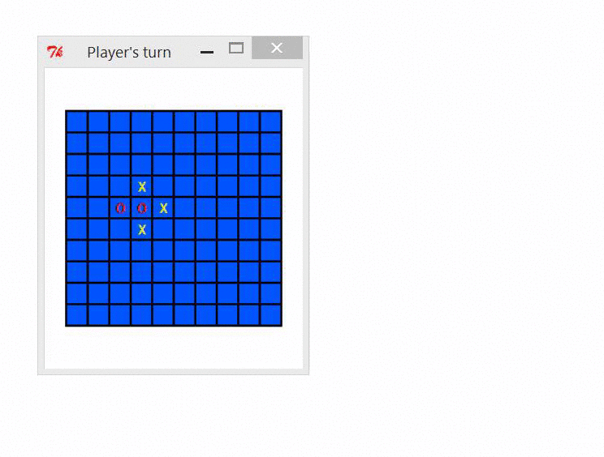
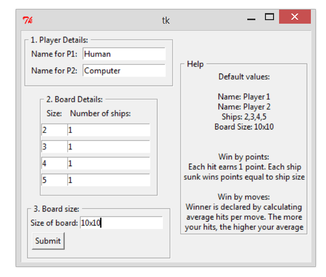
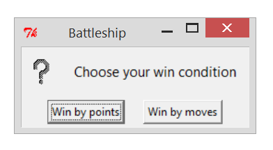
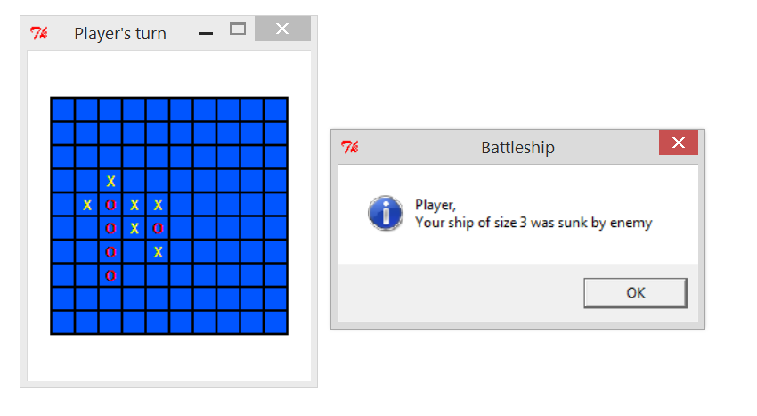
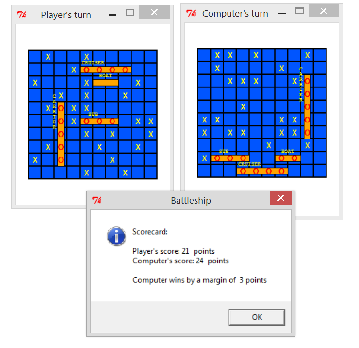

## Battleship

* Multi-player
* Semi-random AI
* In-game score notifications
* Fully customizable game options (number of ships, board size)
* Built with [Tkinter](https://wiki.python.org/moin/TkInter) (Python GUI)

### Demo

### Screenshots

